[BILL_OF_MATERIALS.md](https://github.com/user-attachments/files/29966555/BILL_OF_MATERIALS.md)
# Bill of Materials

Low-power solar remote weather station — Feather M0 + Blues Notecard sensor array.

| Image | Type | Manufacturer | Description | Communication | Connection ports | Power (supply) | Power Demand | Cost (USD) | Link |
|---|---|---|---|---|---|---|---|---|---|
| 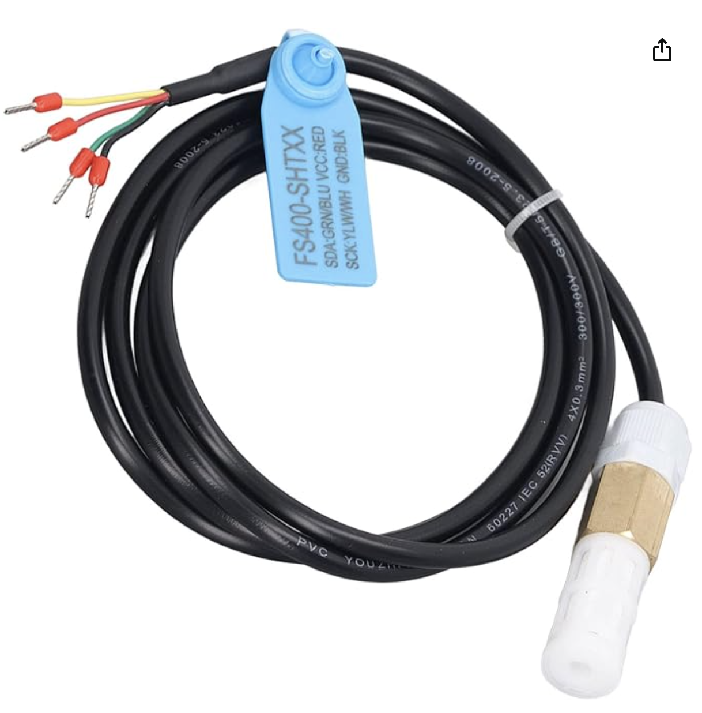 | Temp/RH | Sensirion (SHT3x) | FS400-SHT3X waterproof temp & humidity probe (stainless-steel housing, 150 cm cable) | I2C | VCC, SCL, SDA, GND | 3.3–5 V | < 10 mA | $23.17 1 | [amazon.com.be](https://www.amazon.com.be/-/en/Fs400-Temperature-Humidity-Sensor-Transmitter/dp/B0CZ3JV55J) |
| 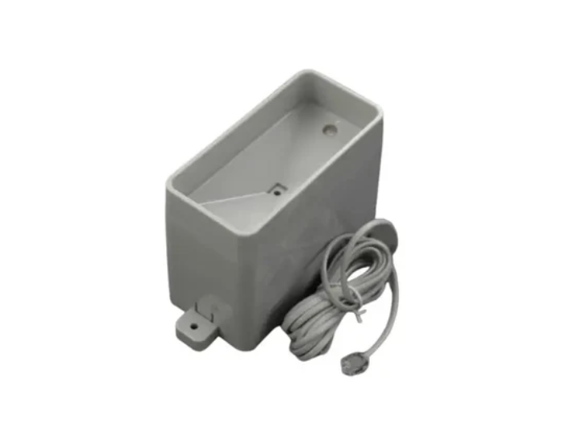 | Rainfall | DFRobot | Gravity: Tipping Bucket Rainfall Sensor (SEN0575) | I2C / UART | VCC, GND, SCL/TX, SDA/RX | 3.3–5.5 V | < 3 mA | $29.90 | [dfrobot.com](https://www.dfrobot.com/product-2689.html) |
| 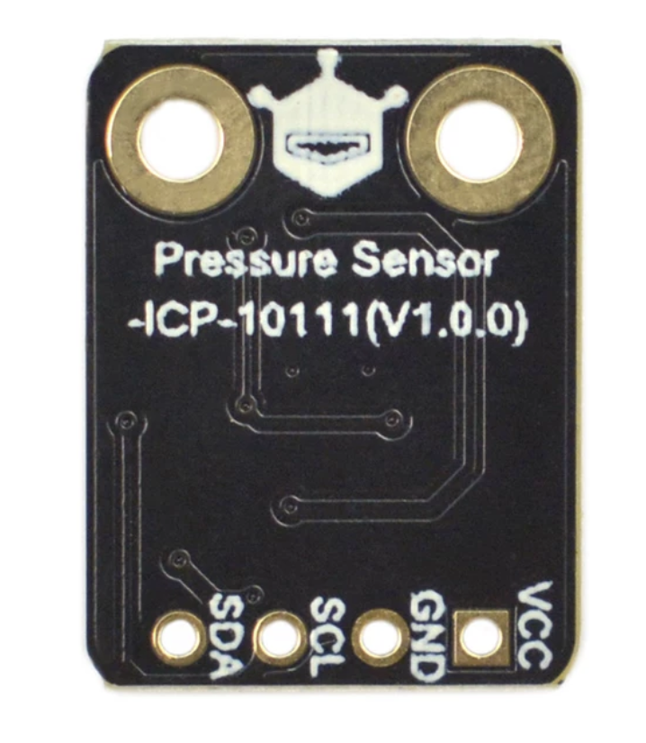 | Pressure | DFRobot | Fermion: ICP-10111 pressure sensor (breakout) | I2C | VCC, GND, SCL, SDA | 3.3–5 V | < 2 mA | $7.90 | [dfrobot.com](https://www.dfrobot.com/product-2524.html) |
| 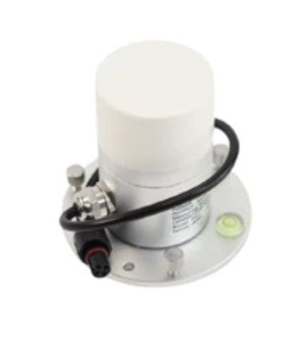 | Solar Radiation | DFRobot | SEN0640 Solar Radiation Sensor | RS485 (Modbus-RTU) | VCC (brn), GND (blk), 485-A (yel), 485-B (blu) | 5–30 V DC | < 10 mA | $59.00 | [wiki.dfrobot.com](https://wiki.dfrobot.com/sen0640/) |
| 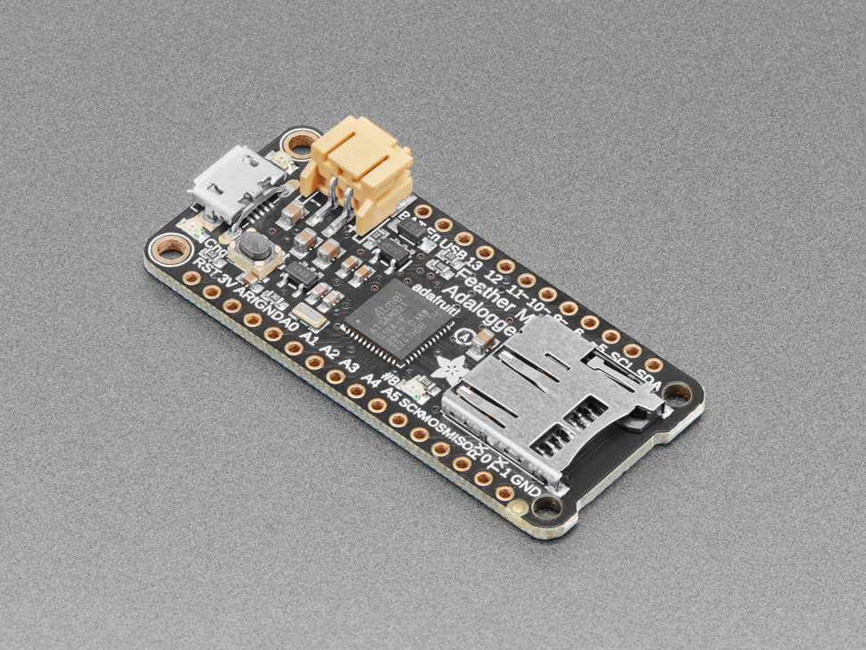 | Datalogger / MCU | Adafruit | Feather M0 Adalogger (built-in microSD slot) | USB, Serial, I2C, SPI | LiPo/USB in; 3.3 V logic | 3.3 V | 500 mA reg peak; 100 mA LiPo charger | $19.95 | [adafruit.com](https://www.adafruit.com/product/2796) |
| 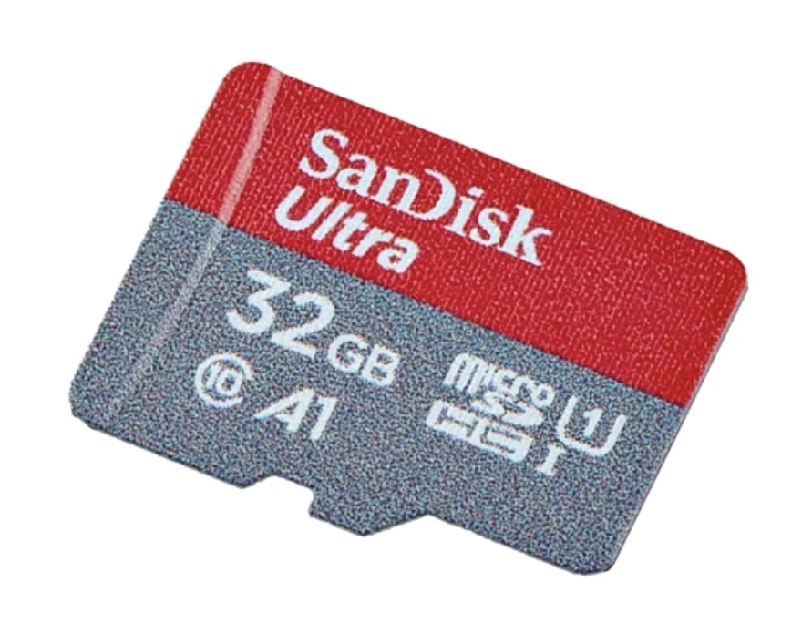 | microSD Card | SanDisk | Ultra microSDHC 32 GB Class 10 (storage; reader is on the Adalogger) | SPI (via Adalogger slot) | — | 3.3 V | — | $32.95 | [sparkfun.com](https://www.sparkfun.com/microsd-card-32gb-class-10.html) |
| 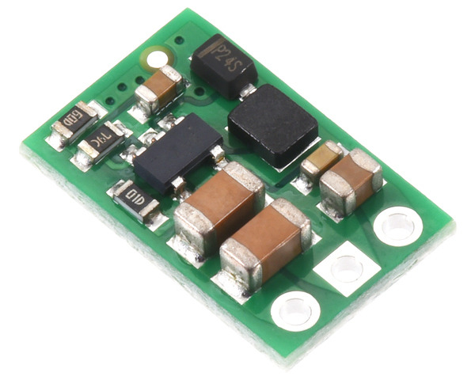 | Boost regulator | Pololu | 9 V Step-Up Regulator U3V9F9 (boosts to power the RS485 SEN0640; replaces discontinued U3V12F9) | — | VIN, GND, VOUT | in ≥ 2.6 V; out 9 V | up to 900 mA in | $3.49 | [pololu.com](https://www.pololu.com/product/5584) |
| 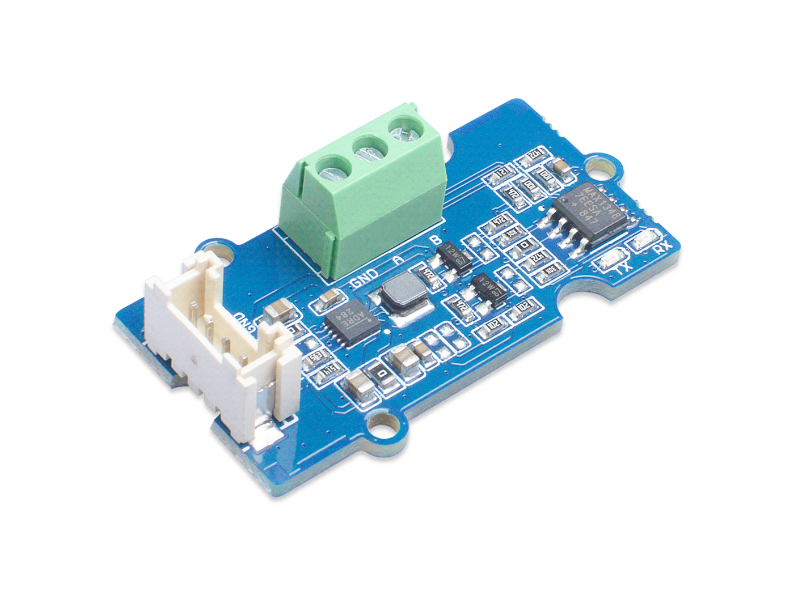 | RS485 module | Seeed Studio | Grove – RS485 (RS485 ↔ UART transceiver) | RS485 ↔ UART | VCC, GND, RX, TX / A, B | 3.3–5 V | — | $6.15 2 | [kiwi-electronics.com](https://www.kiwi-electronics.com/en/grove-rs485-4193) |
| 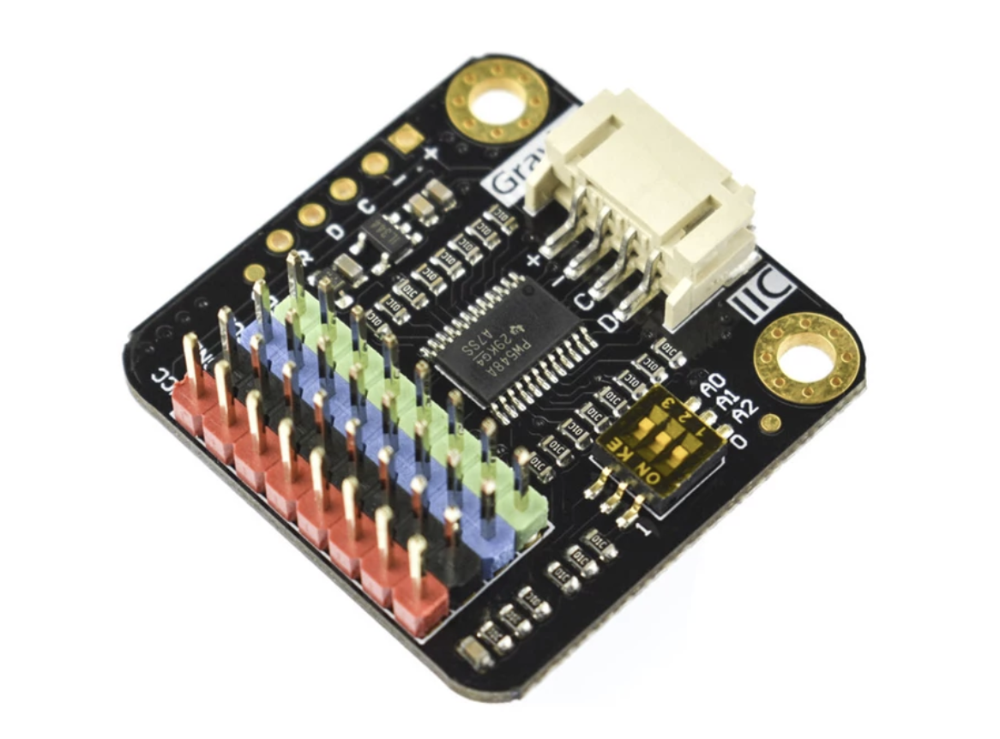 | I2C Multiplexer | DFRobot | Gravity: Digital 1-to-8 I2C Multiplexer (DFR0576, TCA9548A-based; 8-channel fan-out, addr 0x70–0x77) | I2C | 1 in / 8 Gravity out | 3.3–5.0 V | — | $6.90 | [dfrobot.com](https://www.dfrobot.com/product-1780.html) |
| 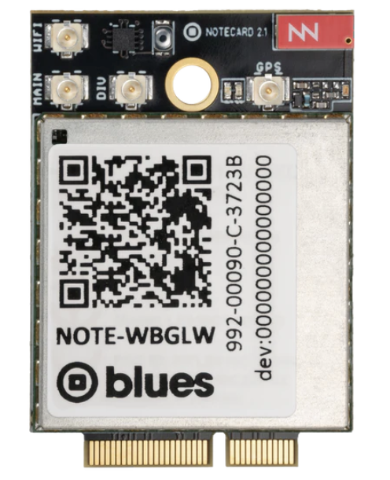 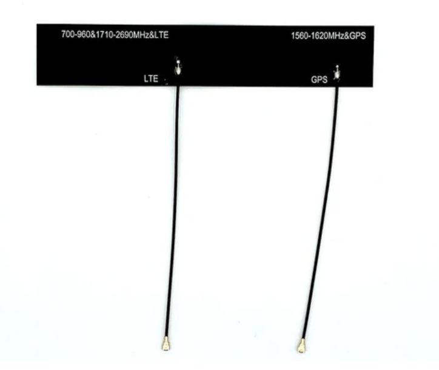 | Cellular Modem | Blues | Notecard Cellular (NOTE-WBEXN, v2.2) — wireless uplink; includes Molex 209142 LTE antenna | I2C / Serial | via Notecarrier | 3.3–5.5 V | — | $49.00 | [dev.blues.io](https://dev.blues.io/datasheets/notecard-datasheet/note-wbex/) |
| 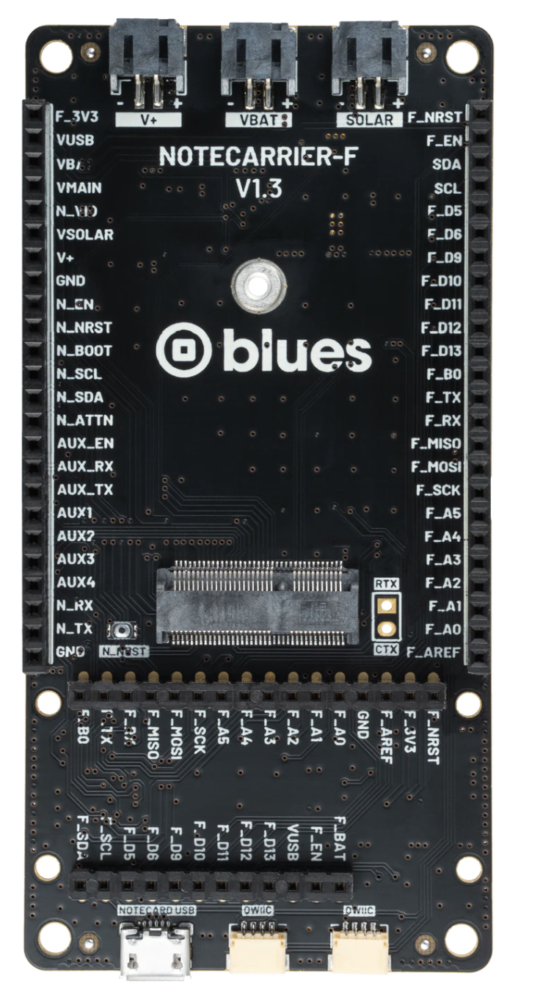 | Carrier board | Blues | Notecarrier-F V1.3 (Feather-compatible carrier for Notecard) | — | Feather headers; V+, VBAT, SOLAR, I2C | 3.3–5.5 V | — | $25.00 | [shop.blues.com](https://shop.blues.com/products/notecarrier-f) |
| 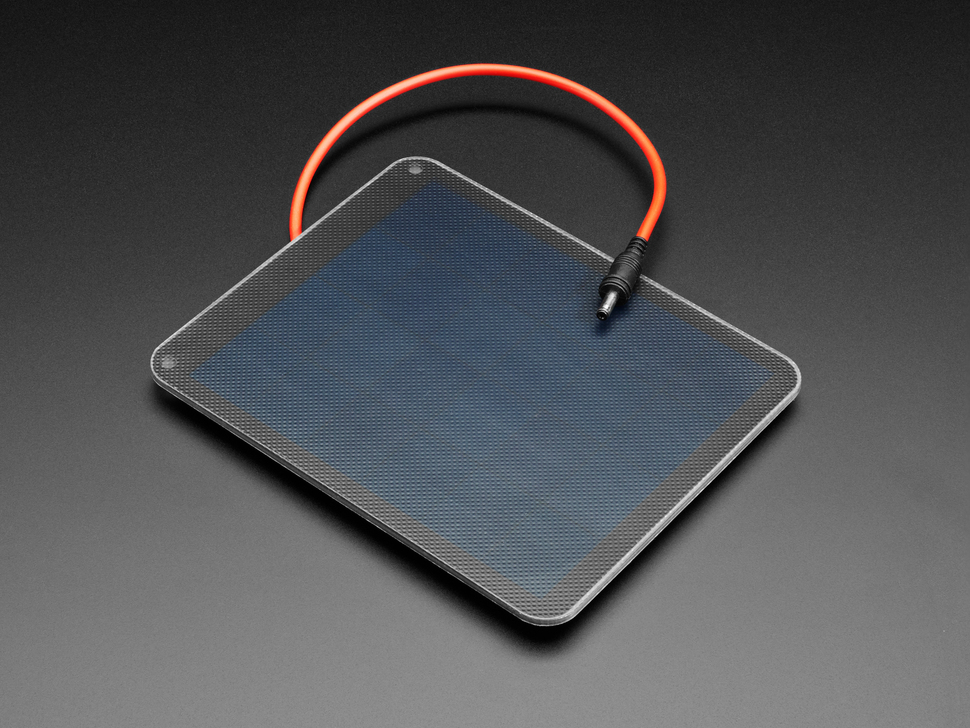 | Solar Panel | Adafruit (Voltaic) | 6 V 2 W Solar Panel – ETFE, P126 (PID 5366) | — (power) | 3.5 × 1.1 mm DC jack | 6 V / 330 mA peak | — | $20.95 | [adafruit.com](https://www.adafruit.com/product/5366) |
| 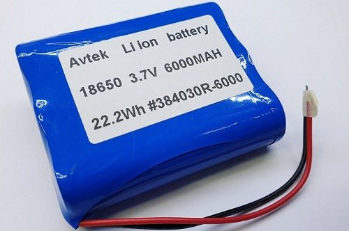 | Battery | Avtek | Li-ion 18650 pack, 3.7 V 6000 mAh 22.2 Wh (384030R-6000) | — (power) | JST-PH | 3.7 V nom. | — | $18.90 3 | [belshop.co.il](https://www.belshop.co.il/items/4350927) |
| | | | | | | | | **≈ $303.26** | **Total** |

All costs normalized to USD. Converted at €1 ≈ $1.08 and ₪1 ≈ $0.27 (approximate). 1 from €21.45 · 2 from €5.69 (kiwi-electronics lists in EUR) · 3 from ₪70.
